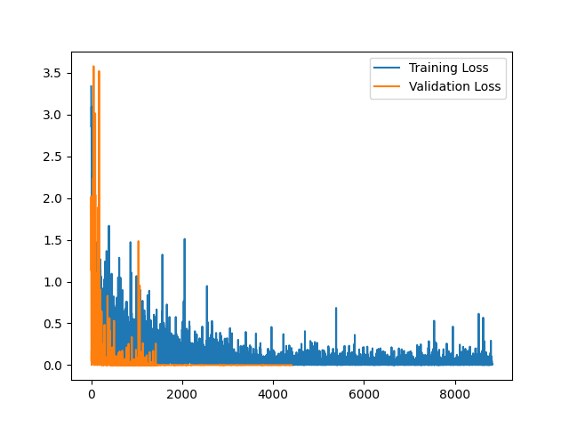

# TorchPy-DCNN-Enhancements

This repository contains an enhanced version of a Deep Convolutional Neural Network (DCNN) implemented using the default TorchPy script. The enhancements include the addition of graphical visualizations and an auto-stop function.

## Features

- **Graphical Visualizations**: This feature allows users to better understand the model's performance through visual representations. The graphs are generated after each epoch and can be found in the `Results` folder.

- **Auto-Stop Function**: This function automatically halts the training process when the model's performance on the validation set stops improving. This saves computational resources and time.

## Results

The `Results` folder contains graphical visualizations of the model's performance. Here are some examples:
### Alexnet Epoch 90 Results

  

- This graph shows the results from using Alexnet and an Epoch of 90. The loss is plotted after every image.

### ResNet Epoch 90 Results

  

- This graph shows the results from using ResNet and an Epoch of 90. The loss is plotted after every image.

### Alexnet Epoch 90 Results (Graphed by epoch)

  

- This graph shows the results from using Alexnet and an Epoch of 90. The loss is plotted after every epoch.

### Alexnet Epoch90 (Added Accuracy Plot)

  
  

- These graphs show the losses and accuracy of the model after every epoch.
- Both the accuracy and losses level off near epoch 40. Auto-stopping may be useful to prevent overfitting the model.

### ResNet Epoch90 (Added Accuracy Plot)

  
  

- These graphs show the losses and accuracy of the model after every epoch.
- Both the accuracy and losses level off near epoch 40. Auto-stopping may be useful to prevent overfitting the model.
- The final and max accuracy is better with ResNet than Alexnet.
